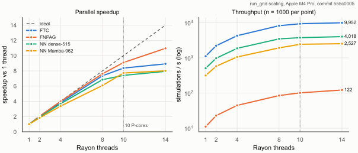
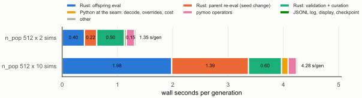

# Performance

What the simulator and the training loop cost, where the time goes, and what an accelerator
port would and would not buy. Every number below comes from one machine and one commit unless a
line says otherwise:

- **Machine**: Apple M4 Pro, 10 performance + 4 efficiency cores, 48 GiB, macOS 26.6.2
- **Build**: rustc 1.98.1, release profile with LTO, f64 throughout; Python 3.14.7
- **Commit**: `555c0005` for `experiments/throughput/throughput.json` (all five stages,
  `sources_clean: true`, 2026-09-24); the Rust microbenchmarks ran on the same tree
- **Regenerate**: `uv run python experiments/throughput/throughput.py` (about 20 minutes; see
  [`experiments/throughput/README.md`](../experiments/throughput/README.md)) and
  `cargo bench --bench tick --manifest-path src/rust/Cargo.toml`

The cells are the paper's deployed operating points from the committed bundle
(`articles/paper/data/runs/`): FTC and FNPAG with their GA-tuned gains, the dense-515 and
Mamba-962 headline networks. The noise regime is the default `per_draw` (ADR-0006).

**Precision.** The three repeats inside a run mostly agree within 5%; the tables quote their
median. Between runs the machine drifts more. A first full run an hour earlier (commit
`99c8ea84`, identical simulator and scaling code, discarded because its provenance stamp was
wrong) measured FTC at 14 threads at 12,307 sims/s against 9,952 here, and dense-515 at 5,052
against 4,018. The cause (thermal or power state, background load) was not isolated. Read the
full-thread numbers as good to about 20% and the ratios within one run as the solid part.

## 1. Thread scaling

One `run_grid` call per point: one deployed cell, n = 1000 seeds of the final-eval pool, three
repeats interleaved across thread counts.

| scheme | mean flight | 1 thread | 10 threads (P-cores) | 14 threads (all) |
|---|---|---|---|---|
| FTC | 478 s | 1,116 sims/s (0.90 ms/sim) | 9,332 (8.4x) | 9,952 (8.9x) |
| FNPAG | 644 s | 11.1 sims/s (89.8 ms/sim) | 101 (9.1x) | 122 (11.0x) |
| NN dense-515 | 780 s | 506 sims/s (1.98 ms/sim) | 3,753 (7.4x) | 4,018 (7.9x) |
| NN Mamba-962 | 767 s | 315 sims/s (3.17 ms/sim) | 2,435 (7.7x) | 2,527 (8.0x) |

Scaling is close to linear up to 8 threads, where parallel efficiency is 0.76 (Mamba) to 0.95
(FNPAG). The four efficiency cores add 4% (Mamba), 7% (FTC, dense-515) and 20% (FNPAG) on top of
the ten performance cores. FNPAG, the scheme with the most work per simulation, scales best;
why the light schemes flatten earlier was not diagnosed. The single-thread costs match the
paper's compute table (`articles/paper/data/compute_benchmark.json`, same CPU model, earlier
commit, `run_batch` and the legacy noise regime) to within 5%.

## 2. The three entry points

Per-sim cost at 1 thread, n = 200 final-eval seeds (the CLI flies 200 draws of the config's own
Monte Carlo instead: the same dispersion model, different scenarios).

| scheme | `run_grid` | `run_batch` | CLI, 200 sims | CLI, simulation phase | CLI, one-sim process |
|---|---|---|---|---|---|
| FTC | 0.891 ms | 0.961 ms | 0.956 ms | 0.910 ms | 8.1 ms |
| FNPAG | 85.7 ms | 87.4 ms | 86.2 ms | 86.2 ms | 64.3 ms |
| NN dense-515 | 1.914 ms | 2.081 ms | 1.994 ms | 1.95 ms | 9.6 ms |
| NN Mamba-962 | 3.138 ms | 3.403 ms | 3.164 ms | 3.12 ms | 10.3 ms |

`run_batch` builds a fresh `SimData` per override (TOML patch, serialize, parse, and for an NN the
model JSON read and parse), which costs 0.07 ms per sim for FTC and 0.27 ms for Mamba, 8% in
both cases. For FNPAG the 2% gap is inside the repeat spread. `run_grid` builds one `SimData` per
individual and reuses it across the seed axis (ADR-0004). Amortized over 200 sims the CLI costs
the same as the seam. A one-sim CLI process spends about 7 ms on start-up, config and table
load before the first tick, eight FTC simulations' worth, so process-per-simulation evaluation
would be dominated by it.

## 3. Where a training generation goes

The real GA loop (`trainer.run_loop`), resumed from the headline run's generation-20000
checkpoint at the paper allocation (512 individuals x 2 seeds, adaptive seeds with curation every
2 generations, the validation gate on) and at 512 x 10 for contrast. 20 generations each, plain
display (no Rich TUI), the once-per-run final selection excluded. Each loop phase is timed, and
inside each phase the time in `aerocapture_rs.run_grid`, in the Python that prepares the call and
in `compute_cost`.

| seconds per generation | 512 x 2 | 512 x 10 |
|---|---|---|
| Rust: offspring evaluation | 0.370 | 1.594 |
| Rust: parent re-evaluation after a seed change | 0.203 | 0.976 |
| Rust: validation gate | 0.259 | 0.282 |
| Rust: seed curation | 0.188 | 0.212 |
| **Rust total** | **1.021 (83%)** | **3.063 (91%)** |
| Python: gene decode, override dicts, weight matrix | 0.002 | 0.002 |
| Python: cost function | 0.032 | 0.097 |
| pymoo operators (selection, SBX, mutation, duplicate elimination, survival) | 0.144 | 0.149 |
| JSONL log and display | 0.024 | 0.024 |
| checkpoint I/O (every 10th generation) | 0.001 | 0.001 |
| other (seed draw, gate and curation bookkeeping) | 0.010 | 0.012 |
| **total** | **1.234** | **3.349** |

Offspring evaluation is 30% of a generation at the paper allocation. The adaptive-seed
methodology's own simulations (re-scoring the parents on fresh seeds, curating the next seed set,
validating a new argmin) take 53%. That is the price of the methodology the paper found
load-bearing, not overhead. The Python side is 0.21 s per generation and grows only through the
per-cell cost function (0.29 s at 512 x 10), so its share falls from 17% to 9%.

Top five by self time under cProfile (same 20 generations, 512 x 2; `run_grid` excluded):

| # | function | where | self time over 20 gens |
|---|---|---|---|
| 1 | scipy `cdist_euclidean` | pymoo duplicate elimination, `pymoo/core/duplicate.py:66-70` via `pymoo/util/misc.py:155` | 2.05 s |
| 2 | scipy `pdist_euclidean` | `population_diversity`, `src/python/aerocapture/training/metrics.py:33` | 0.47 s |
| 3 | `compute_cost` | `src/python/aerocapture/training/cost.py:98` (72,744 scalar calls) | 0.37 s |
| 4 | `cross_sbx` | `pymoo/operators/crossover/sbx.py:14` | 0.27 s |
| 5 | `_softplus` | `src/python/aerocapture/training/cost.py:62` (290,976 calls) | 0.26 s |

Duplicate elimination, pymoo's GA default and left on by `optimizer.py`, computes offspring x
offspring and offspring x population distance matrices (512 x 512, 518 dimensions) on every
mating round, about eight calls per generation: 0.10 s, 70% of the pymoo share and 8% of a
generation. The diversity metric written to every JSONL record is the whole logging cost.
Turning duplicate elimination off would change which offspring survive whenever an exact
duplicate occurs, so it is a training-behaviour change with its own gate, not a free win.

The loop's own per-generation stamp (`gen_elapsed_s`, from `advance` to `emit`, which excludes
the parent re-evaluation and the checkpoint) has a median of 0.89 s here. The headline campaign
logged a median of 1.15 s over its generations 5001-20000
(`training_output/mamba_p962_long/run_000_20260625T124403.jsonl`: June 2026 code, the Rich TUI
on, the run-to-run spread above). The gap was not diagnosed.

## 4. Inside `run_grid`: setup vs cells

Wall of one `run_grid` call through `AerocaptureProblem` (in-memory weights, the global Rayon
pool) on the converged 512-individual headline population, against the seeds per individual k:
wall = 0.030 s + 0.184 s x k (k = 1, 2, 4, 8; worst residual 0.041 s). The intercept is the
parallel `SimData` build for 512 individuals, the slope 512 cells at 0.36 ms of wall each. At the
paper's k = 2 the build is 7.5% of the call. The intercept is the size of the residual, so the
honest reading is that setup is under a tenth of the call, not a precise 7.5%.

## 5. Onboard guidance cost per scheme

`src/rust/benches/tick.rs` replays every guidance call of one nominal (undispersed) flight from
its exact pre-call state and checks the replay against the flight bit for bit before timing
anything. The time is guidance only: no navigation, pilot or plant. Classical schemes fly their
golden test configs; the NN rows fly the deployed bundle models.

| scheme | config | guidance calls | guidance per flight | per call |
|---|---|---|---|---|
| FTC | golden | 534 | 354 µs | 0.66 µs |
| Equilibrium glide | golden | 266 | 40.1 µs | 0.15 µs |
| Energy controller | golden | 428 | 92.8 µs | 0.22 µs |
| PredGuid | golden | 437 | 84.7 µs | 0.19 µs |
| FNPAG | golden (`prediction_dt` = 2.0 s) | 460 | 130 ms | 283 µs |
| Piecewise constant | training config | 526 | 61.4 µs | 0.12 µs |
| NN dense-515 | deployed | 781 | 863 µs | 1.10 µs |
| NN Mamba-962 | deployed | 731 | 1.97 ms | 2.70 µs |

The Mamba forward pass alone (`cargo bench --bench quant_forward`, deployed f64 runtime, same
tree) is 1.96 µs, 73% of the Mamba guidance call. The rest builds the 35-candidate input vector,
which includes a per-tick correction-DV prediction on the osculating orbit.

Combining the per-call cost with the dispersed flights of section 1 (one guidance call per
1 s tick) estimates guidance's share of a simulation at 35% for FTC, 44% for dense-515 and 65%
for Mamba-962. Navigation plus plant integration comes to 1.2-1.4 µs per tick for all three. The
policy, not the plant, is the larger half of a Mamba simulation.

FNPAG's cost is an operating-point property. Its predictor integrates forward at
`prediction_dt`, which the GA tuned from the default 2.0 s to 3.76 s. The deployed FNPAG cell
flown at 2.0 s instead costs 160 ms/sim against 86 ms at its tuned step (1 thread, n = 50, two
repeats, commit `555c0005`), a 1.87x ratio for a 1.88x step ratio. The step accounts for the
golden-config row above costing more per flight than the deployed cell's whole simulation.

## 6. Determinism across thread counts

`tests/test_thread_invariance.py` (a CI gate, unlike everything above) asserts that `run_grid`
output is byte-identical at `n_threads` = 1, 3, all cores and the global pool, for dispersed
equilibrium glide (fixed-step and adaptive with event location), FNPAG, the deployed Mamba-962
and in-memory dense weights. Each cell owns its `SimState` and RNG streams, `SimData` is shared
read-only, and Rayon's indexed collect places every result by index whatever order the cells
ran in. The gate extends ADR-0004's bit-identity claim to the parallel axis.

## 7. Memory

Peak RSS a `run_grid` call adds, in a fresh process per shape (Mamba-962; the process sits at
30 MiB after import and a one-sim warm-up):

| grid | peak RSS added | output array |
|---|---|---|
| 64 x 2 | 7.0 MiB | 0.05 MiB |
| 512 x 2 (paper allocation) | 15.4 MiB | 0.41 MiB |
| 2048 x 2 | 44.4 MiB | 1.62 MiB |
| 1 x 1000 (validation shape) | 1.9 MiB | 0.40 MiB |

About 19 KiB per individual. Memory does not constrain any grid this project runs: a population
100 times the paper's would fit in about a GiB.

## 8. An accelerator path: feasibility note

**The workload.** A paper-allocation generation flies about 2,600 trajectories (offspring,
re-evaluated parents, validation, curation) of about 770 one-second ticks: 1.02 s of Rust wall on
14 threads. Each trajectory is a strictly sequential chain of ticks, so the parallelism is across
trajectories only, 2,600 wide. Per tick, navigation plus plant cost 1.2-1.4 µs and the Mamba
policy 2.7 µs of scalar f64 code.

**What a port would buy.** The DeepMind-style move is a batched plant in JAX: the tick written
as array code, `vmap` over trajectories, `lax.scan` over ticks, the whole rollout one jitted
program. That is the Brax / MJX pattern, not those engines, since this plant is a 3-DOF point mass
with aero tables rather than a rigid-body system. The ceiling is set by the loop around the
simulator, and it is measured: with a free simulator, the 0.21 s of Python per generation caps
the speed-up at 5.8x at 512 x 2 and 11.7x at 512 x 10, unless the optimizer moves on-device too
(an evosax-style GA). At the paper's allocation the batch is also small for an accelerator: 2,600
trajectories stepped through 770 dependent ticks is a latency-bound workload. The case for a port
is therefore not a faster paper run. It is allocations the CPU cannot afford: populations and
seed counts ten to a hundred times wider (the campaign already found the ~4,000-parameter cells
need wide populations, `experiments/paper/10_architecture_sweep.sh`), where CPU cost grows
linearly at about 2,500 Mamba trajectories per second. No accelerator was measured; the Amdahl
ceilings are the only quantitative claim here.

**What it would cost.**

- *A second simulator.* Everything in the tick moves to array form: the bias filter and the
  13-state EKF, the seven guidance laws with lateral reversal logic, thermal limiter, command
  shaping and pilot, the Gill RK4 plant and the table lookups (atmosphere, aerodynamics, reference
  trajectory, as gathers). Discrete logic (phase switches, roll reversals, bounce and pending-crash
  classification) becomes masked `where` that evaluates both branches. Adaptive DOPRI45 with
  sub-tick event location has no clean lockstep form, but training already runs fixed-step
  (`[integration] mode = "fixed"` in `configs/training/common.toml`). FNPAG's predictor, a nested
  integration whose length varies per trajectory, is the worst fit and would run as a bounded,
  masked loop. The Rust simulator stays as the reference for deploy-side evaluation, so the two
  must be held together by equivalence gates, as the PyTorch mirror of the NN runtime already
  is.
- *Bit identity.* XLA reorders floating-point work, and f64 throughput on most GPUs is a small
  fraction of f32 (Apple-silicon GPUs have no f64 at all). The six guidance goldens, the 22/24
  columns matched to the reference implementation and the `run_grid` bit-identity gates would
  all become tolerance gates. The AMAT cross-check and the published corridor in
  `docs/validation.md` would need re-running against the port, and every number in the paper was
  produced on the f64 CPU simulator. A policy trained on the port would need a statistical
  equivalence study (the same Monte Carlo distributions within stated tolerance) before it could
  be compared with them.
- *Differentiability* would come almost free with JAX, but the objective is discontinuous
  (capture vs crash, event-driven termination), so gradients through rollouts are a research
  question, not a speed-up.

**Cheaper wins first.** Measured above, on the CPU, without touching the physics: duplicate
elimination (8% of a generation), the per-generation diversity metric (2%) and scalar
per-cell cost calls (2.6%, vectorizable). Together about 12% of a paper-allocation generation.

**Verdict.** Not worth building for the paper's allocation: the measured ceiling is under 6x and
it gives up the bit-identity and physics validation the results rest on. Worth building only if
the research question becomes what a 10-100x wider population or seed budget buys, and then with
the optimizer on-device as well.
